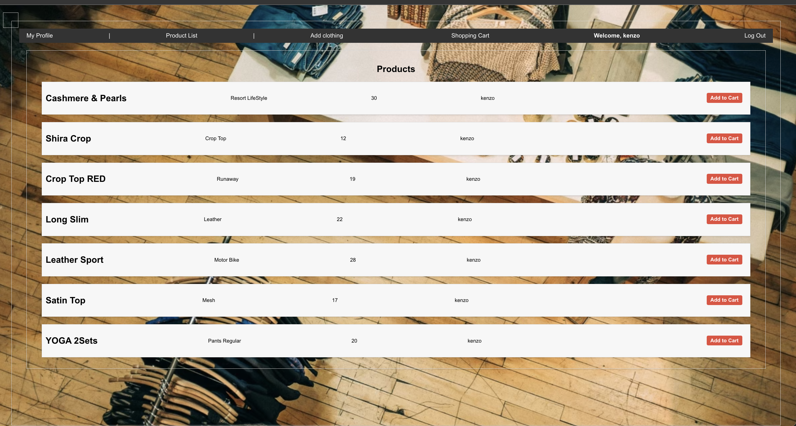

# Vintage Thrift Store Web App

Welcome to the Vintage Thrift Store Web App.

## Introduction
Virtual Thrift Store is a web application that allows users to buy and sell secondhand clothing and accessories. Users can add items to their cart, negotiate prices, and complete purchases.

## Features
The application includes token-based authentication for user registration, login, and logout. Certain routes and features are restricted to authenticated users. You can further customize the authorization logic based on user roles (e.g., admin and regular users).

In addition to the core features, you can implement additional functionality, such as:

Integration with a third-party API to fetch data.
User roles and permissions.
Dynamic UI elements and data visualization.

## Getting Started

https://trello.com/b/KcAU76yc/vintage-thrift-store

https://vintage-thriftstore-1f386a396212.herokuapp.com/

## Screen Shots

*LogIn & SignUp.*

*ProductList.*

*AddClothing.*

*ShoppingCart.*

## Technologies Used
The project is built using the MERN stack:

MongoDB and Mongoose for the database.
Express.js for the backend server.
React for the frontend.
Node.js for the server runtime.

backend: Backend server and API.
frontend: React frontend.

## Enhancements
ice box features
profile landing page for the user
enhance my css features

## Contributing

Contributions are welcome! If you have any ideas, suggestions, or improvements for the Cartoon Web App, feel free to open an issue or submit a pull request. We'd love to hear from you.

## License

This project is licensed under the MIT License. Feel free to use, modify, and distribute the code as per the terms of the license.
